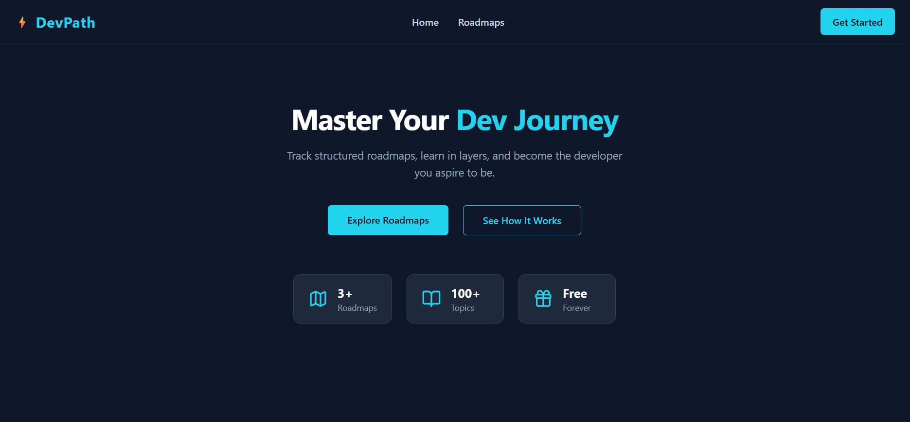
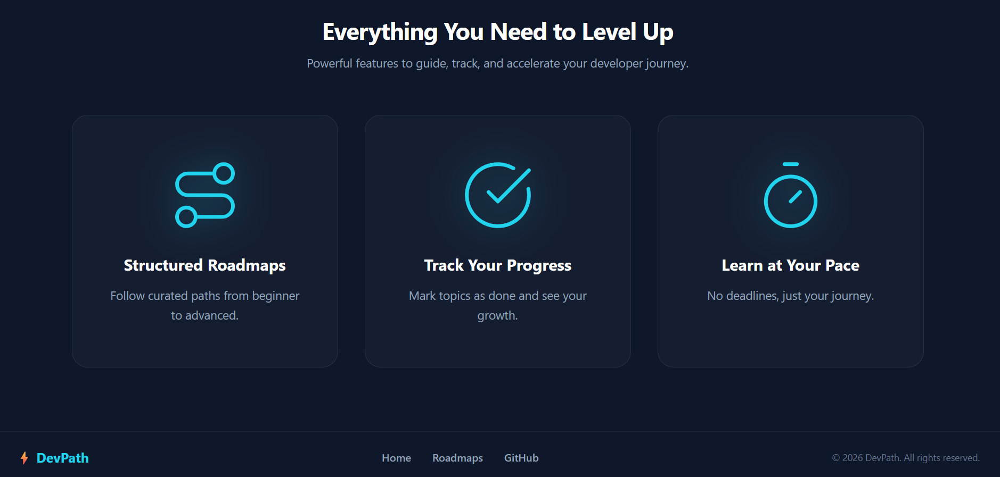
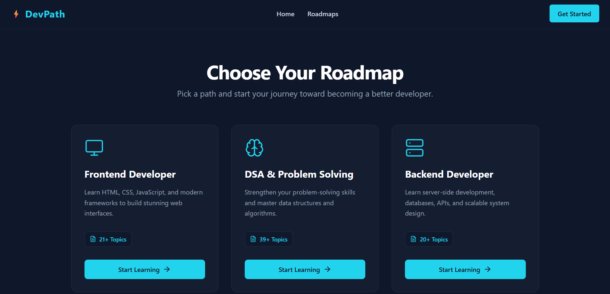
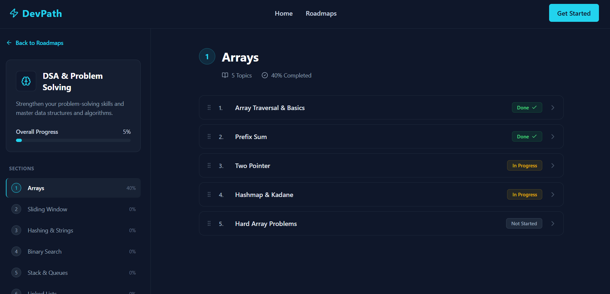
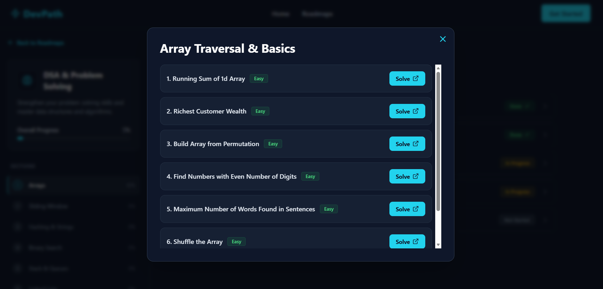

# ⚡ DevPath

**DevPath** is a developer roadmap tracker that helps you follow structured learning paths for Frontend, Backend, and DSA — track your progress topic by topic, and pick up right where you left off.

🔗 **Live Demo:** [devpath-two-xi.vercel.app](https://devpath-two-xi.vercel.app/)

---

## 📸 Screenshots

### Landing Page


### Features


### Roadmaps List


### Roadmap Detail — Progress Tracking


### Topic Detail Modal


---

## ✨ Features

- **Structured Roadmaps** — Curated learning paths for Frontend, Backend, and DSA & Problem Solving
- **Progress Tracking** — Mark topics as Not Started / In Progress / Done, with live progress bars per section and overall
- **Persistent Progress** — Progress is saved to `localStorage`, so it survives page refreshes and browser restarts
- **Topic Detail Modals** — Click any topic to view a description and real-world usage context
- **DSA Question Modals** — Dedicated modal for DSA topics showing difficulty-tagged LeetCode questions with direct solve links
- **Fully Responsive** — Clean experience across desktop, tablet, and mobile, including a dedicated mobile navigation menu
- **Dark Theme UI** — Consistent navy (`#0F172A`) and cyan (`#06B6D4`) design system throughout

---

## 🛠️ Tech Stack

- **React** — UI library
- **Vite** — Build tool & dev server
- **Tailwind CSS** — Styling
- **React Router** — Client-side routing
- **Lucide React** — Icon library
- **localStorage API** — Client-side progress persistence

---

## 🚀 Getting Started

Clone the repo and run it locally:

```bash
git clone https://github.com/naved-cse/devpath.git
cd devpath
npm install
npm run dev
```

The app will be running at `http://localhost:5173`.

---

## 📁 Project Structure

```
src/
├── components/     → Reusable UI components (Navbar, Footer, RoadmapCard, TopicModal, DSAModal, etc.)
├── pages/          → Route-level pages (Landing, RoadmapList, RoadmapDetail)
├── data/           → Roadmap data (roadmaps.js)
├── hooks/          → Custom hooks (useProgress — localStorage logic)
├── App.jsx         → App routes
└── main.jsx        → Entry point
```

---

## 🗺️ Roadmap (What's Next)

- [ ] Backend integration — user accounts, progress synced across devices
- [ ] More roadmap tracks (Mobile Dev, DevOps)
- [ ] Notes feature per topic

---

## 📄 License

This project is licensed under the MIT License — see the [LICENSE](./LICENSE) file for details.

---

## 👤 Author

**Naved**
Built as a personal project while learning React — 3rd year CSE student.

- GitHub: [@naved-cse](https://github.com/naved-cse)
